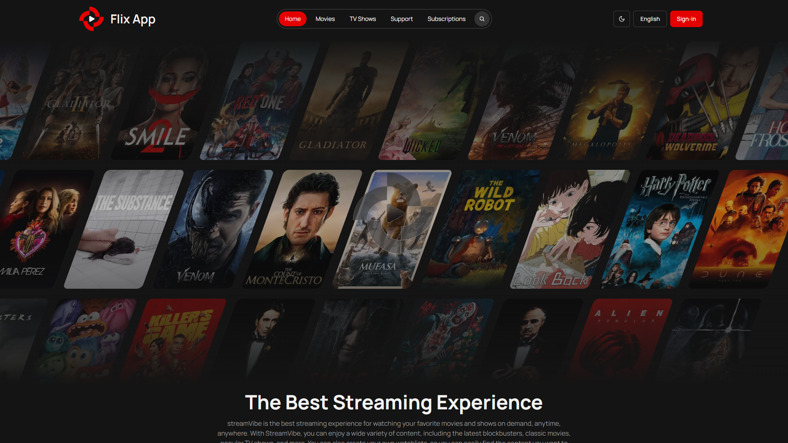

# 🎥 Flix App

_A sophisticated streaming platform built with Next.js 14 and TypeScript, powered by TMDB API_

## 📋 Table of Contents
- [🌟 Overview](#-overview)
- [🚀 Features](#-features)
  - [🔐 Authentication & Security](#-authentication--security)
  - [🎬 Core Features](#-core-features)
  - [💳 Premium Features](#-premium-features)
  - [🎨 Technical Features](#-technical-features)
- [💻 Tech Stack](#-tech-stack)
  - [Frontend](#frontend)
  - [Backend & Services](#backend--services)
  - [DevOps & Monitoring](#devops--monitoring)
- [👥 Contributors](#-contributors)
- [📜 License](#-license)

## 🌟 Overview

Flix App is a modern streaming platform inspired by Netflix and [StreamVib](https://www.figma.com/community/file/1294589591426976269). Built with performance and user experience in mind, it leverages:

- **Next.js 14** for optimal performance
- **TMDB API** for rich content
- **Clerk** for secure authentication
- **Firebase** for real-time features
- **Stripe** for subscription management

## 🚀 Features

### 🔐 Authentication & Security
- Secure authentication via Clerk
- OAuth support (Google, Discord, Fackbook)
- Role-based access control
- Protected routes and API endpoints

### 🎬 Core Features
- Advanced content discovery
- Real-time search with filters
- HD video streaming
- Interactive watchlists
- Personalized recommendations
- Multi-language support (اللغة العربية, English)
- Custome Player (It's only support a static video)

### 💳 Premium Features
- Stripe subscription integration
- Multiple pricing tiers
- Exclusive content access

### 🎨 Technical Features
- Server-side rendering
- Progressive web app support
- Responsive design
- Dark/light themes
- Performance monitoring
- Error tracking via Sentry

## 💻 Tech Stack

### Frontend
- Next.js 14
- TypeScript
- Tailwind CSS
- GSAP

### Backend & Services
- Firebase
- Clerk Authentication
- Stripe Payments
- TMDB API
- Custom Node.js Background Music API

### DevOps & Monitoring
- VPS deployment
- Plausible Analytics
- Sentry error tracking

## 🤝 Contributors

### Thanks to everyone who contributed to this project!

<table> <tr> <td align="center"> <a href="https://github.com/KareemAdelAwwad">    <b>Kareem Adel</b> </a> </td> 
<td align="center"> <a href="https://github.com/ibrahimwael951">    <b>Ibrahim Wael</b> </a> </td> 
<td align="center"> <a href="https://github.com/https://github.com/HassanMo1390">    <b>Hasan</b> </a> </td> 
</tr> </table>

---

## 📜 License
This project is licensed for **personal use only**. Redistribution, modification, or commercial use is not permitted.